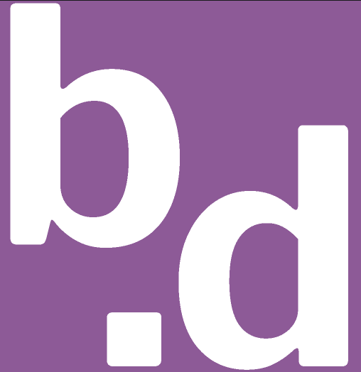

<h1 align="center"><a href="https://bdov.dev">bdov.dev</a></h1>

    My personal portfolio website.

    

## Description :speech_balloon:

The static content behind my personal portfolio website. Built from scratch using [Bulma CSS](https://bulma.io/), animated with [jQuery](/https://jquery.com/), and deployed using Zeit's [Now](https://zeit.co/now).

## Usage :running:

I develop bdov.dev on [Node.js](https://nodejs.org) version 12.4.0 with [npm](https://www.npmjs.com/) version 6.9.0.

Install packages: `npm install --only=dev`
Run development mode: `npm start`
Build production: `npm run css-deploy && npm run js-build`
Deploy: `npm run deploy-production`

## Author :black_nib:

* __Brennan D Baraban__ <[bdbaraban](https://github.com/bdbaraban)>

## License :lock:

This project is licensed under the MIT License - see the
[LICENSE](./LICENSE) file for details.